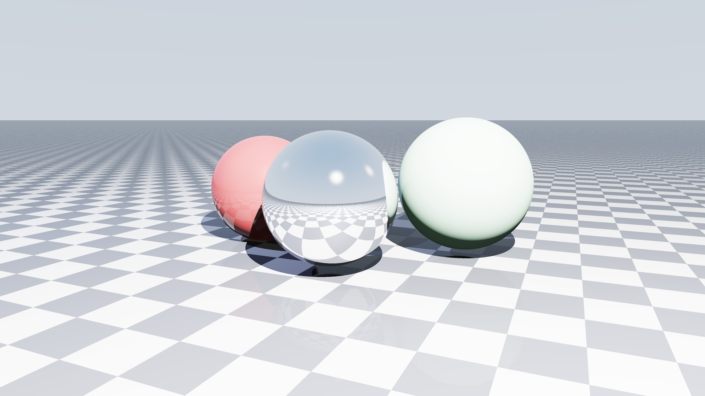
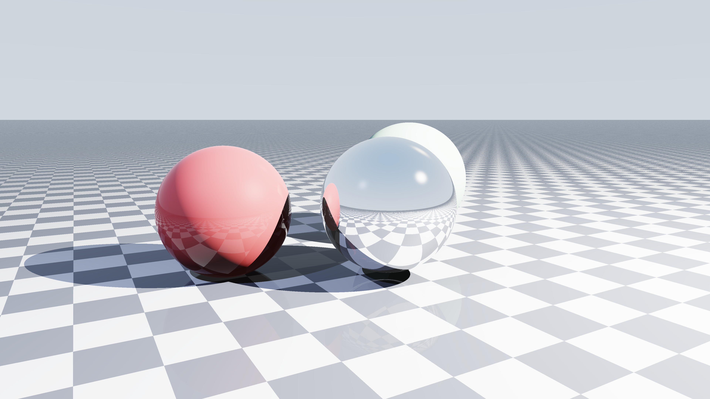

# CUDA Ray Tracer with Multi-View Rendering

## Overview

This project is a Python-based ray tracer that supports both CPU rendering and full GPU rendering with CUDA through Numba. The renderer generates a reflective and refractive sphere scene over a checkerboard plane and can export the scene from multiple camera viewpoints.

The project was built to demonstrate the core ideas of ray tracing, recursive light transport, reflections, refractions, Fresnel effects, plane and sphere intersections, and multi-view scene rendering.

The repository is designed so that you can:

- render a quick preview
- render with a CPU fallback path
- render with a full CUDA GPU path
- generate multiple viewpoints automatically
- optionally render a 4K version on the GPU

---

## Features

### Rendering Features
- Sphere intersection
- Plane intersection
- Recursive ray tracing
- Reflection
- Refraction
- Fresnel blending using Schlick approximation
- Checkerboard plane shading
- Multi-light illumination
- Multiple predefined viewpoints
- CPU fallback rendering
- Full GPU CUDA rendering
- Optional 4K GPU render mode

### Outputs
The renderer currently generates the following camera views:

#### View 1 - Front


#### View 2 - Right


#### View 3 - Left


#### View 4 - Wide


#### View 5 - Closeup


### Render Modes
The program supports four runtime presets:

1. **Fast low-res preview**
2. **CPU multiprocessing / CPU fallback**
3. **Full GPU CUDA render**
4. **4K GPU CUDA render**

---

## Repository Structure

```text
.
├── README.md
├── raytracer.py
├── requirements.txt
├── environment_notes.md
├── outputs/
│   ├── view_1_front.png
│   ├── view_2_right.png
│   ├── view_3_left.png
│   ├── view_4_wide.png
│   └── view_5_closeup.png
└── screenshots/
    ├── terminal_progress.png
    └── sample_render.png

## Lie-Group Camera Animation Menu

Run the project normally:

```bash
python raytracer.py
```

The menu now includes assignment presets. For the easiest full deliverable, choose:

```text
5. RECOMMENDED: high-res 1080p animation + MP4 + trajectory plot
```

Option 5 automatically creates:

- `lie_animation_output_RECOMMENDED_1080p/frames/`
- `lie_animation_output_RECOMMENDED_1080p/lie_group_camera_animation.mp4`
- `lie_animation_output_RECOMMENDED_1080p/camera_trajectory.png`

The report is kept separate as `lie_group_animation_report_SEPARATE.md`. The script does not generate report files inside the animation output folder.

The terminal prints frame progress, row progress, elapsed time, and ETA while rendering.

Other useful options:

```text
6  Quick tiny test animation + MP4
7  Trajectory plot only
8  CPU 640x400 animation + MP4
9  GPU 720p animation + MP4
10 GPU 1080p smoother animation + MP4
11 GPU 4K short animation + MP4
12 Bonus tangent-space perturbed animation + MP4
```

If CUDA is available, option 5 uses GPU automatically. If CUDA/Numba fails because `libdevice` or CUDA compiler files are missing, the program now stops cleanly and prints the exact install command instead of showing a long traceback. For CPU fallback, use option 8.
